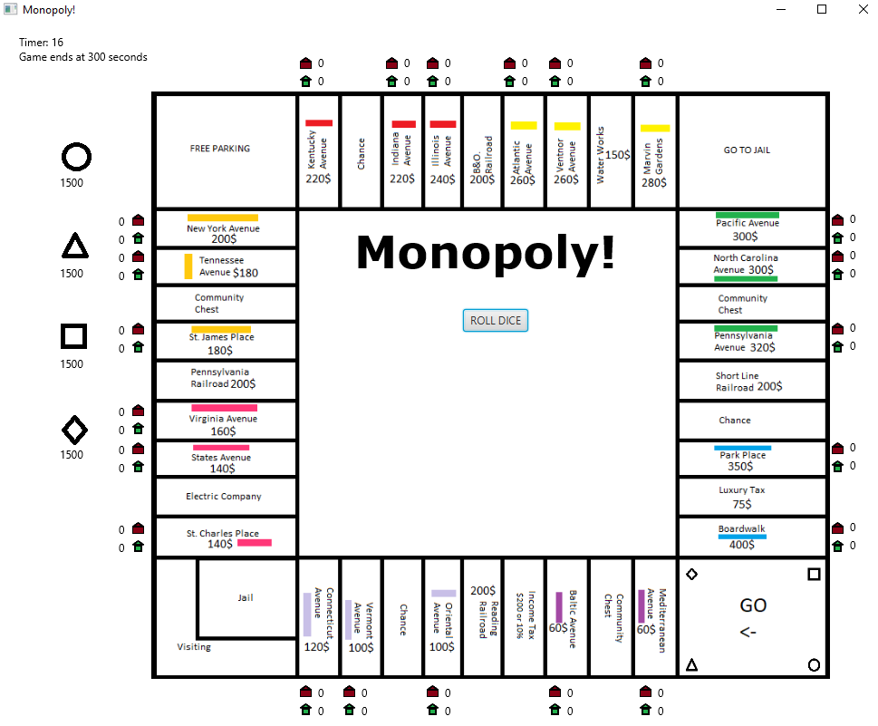
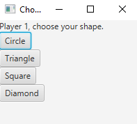

# Build/Running

Javafx version: 15

Main class: Client.java

# Monopoly
The game takes in the already widely popular game, taking it's elements, and twisting it in some aspects to make it our own. 

## Features

The players begin with a pop-up box asking for how many players are playing; The game only will take 2-4 players.

An additional pop-up box appears thereafter beginning with player 1 to pick their shape through a button that will then be displayed on the board. 
The pop-up box will continue to reappear until it has cycled through all the players. Shapes cannot be repeated, each player must have different shapes.

The game now begins!
Player 1 starts by rolling the dice which is found by clicking on the button in the middle of the board. 
The player is then moved onto the board and a pop-up box appears by describing what they've landed on and buttons to press if there are options available.
The process will continue throughout all other player's turns.

On the left side of the board, all the players can be found with their shapes with player 1 starting on the top. 
The money they have on hand is displayed right below the shape and is automically taken care of when money is being added or subtracted.

What options do players have on the board? If they land on a property, the pop-up box will allow them to pass or buy the specific property. 
Furthermore, if they land on the property once more, they will have the option to buy a house or hotel. 
Number of hotels and houses can be found around the board right off the side of the property they are referring to. Houses are colored as green and hotels are red.
For any other player landing on the bought property, they will have to pay the rent associated to the property.
Railroads and utilities work in the same way aside from the house or hotel option. Colors don't do anything at this time and will be updated for the next version.

Income tax on the board gives the player who lands on it an option to pay 10% of all their money and properties combined or they can pay a flat fee of 200 dollars; A pop-up box gives them this option.

Landing on the go to jail spot automatically redirects the player to the jail spot on the board and they will have to wait 3 turns to get out of it. 
Their turns will automically be skipped when it comes to their turn.

A timer is shown on the top left and will stop counting at 300 seconds. This gives the game 5 minutes of continuous play time. Even when the timer reaches 300 seconds,
the last player at the time can still roll the dice to finish the turn. Once this is done, the dice roll button disappears and text is shown in the middle who won.
Multiple player ties and single wins are all possible. It counts the player's networth which is everything the player owns and the money they have.

## Design Quality

Design to short and simple, allowing for the player to get right into the game very easily. As mentioned up above in more detail, a pop-up box first appears to enter
how many players there are. An additional pop-up box shows up so that the first player can choose their shape for the board and continues for the other players.

Just like that, monopoly is ready to play with player 1 starting with a button press to roll the dice.

All movement is done automatically. This includes the money that is associated to each player.

All interactions are done with pop-ups and buttons.

## Programming Style

Objects are broken down into their own classes. There is the Main class has most of the JavaFX frontend work. With the Board class, all properties, railroads, utilities are created. Furthermore, has all the string representations for the given box number on the board with 0 being the beginning and wrapping around clockwise up to 40. This class also allows for getting the property, railroad, or utility through a given string value.

Railroad, utility and the property classes or work similiary with handles purchases, rent, seeing if a property is owned by a player or not and retrieving the player. Property goes more in depth with the houses and hotels being set.

The dice class is able to give back a random integer value between 1-6.

The player class has jail functions as well as adding/getting property, utility, and railroad function. The player piece/shape on the board is also associated to the player's class and can be accessed easily. The networth is everything that was bought including the money the player has on hand.

## Versions

Javafx: 15

Javafx should be placed outside of src folder.

application/Main has been compiled by a more recent version of the Java Runtime (class file version 57.0).

